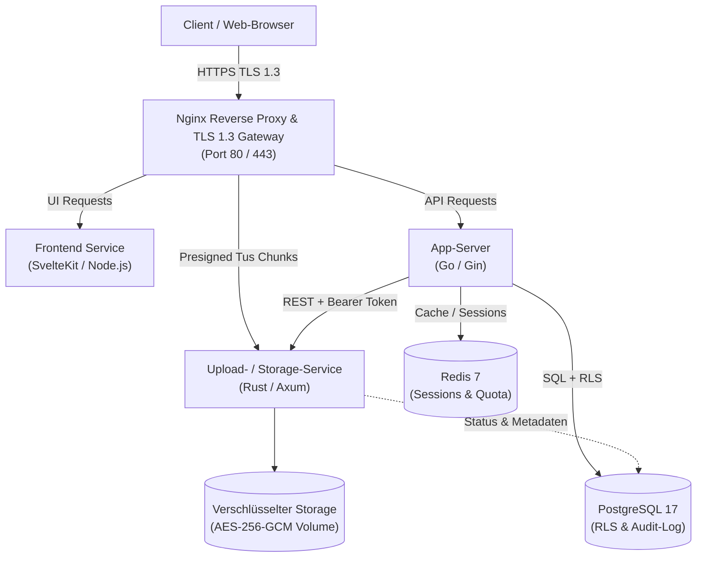

# 4LabCloud

4LabCloud ist eine schlanke, souveräne Open-Source-Cloud-Plattform für verschlüsselten Dateiupload, Freigaben und Medienverwaltung. Die Plattform wurde ohne SaaS-Abhängigkeiten oder externe Tracking-Dienste speziell für maximale Performance, intuitive Bedienung und strikte europäische Datenschutzstandards konzipiert.

[](https://der-felix.github.io/4Lab_Cloud/)
[](LICENSE)


---

## Highlights & Benutzeroberfläche

- **Performantes Dashboard & Dateimanager**: Moderne Oberfläche mit SvelteKit, Dark-/Light-Modus und schnellem Chunk-Upload via Uppy und Tus.
- **Medienverwaltung mit Timeline & EXIF-Sidebar**: Automatische Extraktion technischer Kameradaten (Modell, Objektiv, Blende, Belichtung, ISO, Brennweite) und Gruppierung nach Monaten und Tagen.
- **Integrierte Fotokarte**: Lokales Reverse-Geocoding via Nominatim und Visualisierung aller GPS-Fotos mit interaktiven Leaflet-/OpenStreetMap-Karten.
- **DSGVO & Compliance Out-of-the-Box**: Selbstlöschung nach Art. 17 DSGVO, verschlüsselter ZIP-Export nach Art. 20 DSGVO, Audit-Logs mit HMAC-Pseudonymisierung und striktes TLS 1.3 nach BSI TR-02102-2.

| Chronologische Foto-Timeline | EXIF-Metadaten & Kartenlink |
|---|---|
|  |  |

| Dashboard Minikarten-Vorschau | DSGVO-Self-Service & Export |
|---|---|
|  |  |

---

## Quick Start (Entwicklung)

```bash
cp .env.example .env
podman machine start
cd deploy/podman && podman-compose --env-file ../../.env up -d
# Frontend aufrufen: https://localhost:8443 (Zertifikatswarnung akzeptieren)
```

---

## Architektur-Übersicht



---

## Produktion-Setup (Schritt für Schritt)

### 1. DNS & Server-Voraussetzungen
- Einen Linux-Server mit installiertem `podman` und `podman-compose` bereitstellen.
- DNS-A/AAAA-Record für Ihre Domain konfigurieren (z. B. `cloud.example.com`).
- Ports `80` und `443` in der Firewall freigeben.

### 2. TLS-Zertifikate via Certbot beziehen
```bash
sudo certbot certonly --standalone -d cloud.example.com
# Zertifikate liegen nun unter /etc/letsencrypt/live/cloud.example.com/
```

### 3. Produktions-Umgebung konfigurieren
```bash
cp .env.prod.example .env
# WICHTIG: Alle Passwörter und Schlüssel mit openssl generieren!
nano .env
```
In `deploy/podman/prod/nginx-prod.conf` den Domain-Namen im Zertifikatspfad (`ssl_certificate`) anpassen.

### 4. Container im Produktionsmodus starten
```bash
cd deploy/podman/prod
podman-compose --env-file ../../../.env -f docker-compose.prod.yml up -d
```

### 5. Status überprüfen
```bash
podman ps
podman logs -f 4labs-prod-nginx
```

---

## Backup & Restore Workflow

4LabCloud enthält vollautomatisierte Skripte zur Datensicherung und Wiederherstellung:

### Automatisiertes Backup
```bash
./scripts/backup.sh
```
- Erstellt einen konsistenten Live-Dump der PostgreSQL-Datenbank (`database.sql.gz`).
- Archiviert das verschlüsselte Storage-Volume als `tar.gz`.
- Rotiert Backups nach dem Grandfather-Father-Son-Prinzip (7 Daily, 4 Weekly, 12 Monthly).
- Protokolliert alle Aktionen in `backup.log`.

### Notfall-Wiederherstellung (Disaster Recovery)
```bash
./scripts/restore.sh ./backups/2026-09-18_120000
```
- Fragt vor Überschreiben nach Bestätigung (oder `--force` für CI/Automation).
- Stoppt alle Services, stellt PostgreSQL wieder her, restauriert den Datei-Storage und startet den App-Server zuletzt für saubere Schema-Migrationen.
- Verifiziert den Datenstand durch Zählung der aktiven Benutzerkonten.

---

## Umgebungsvariablen

| Variable | Standardwert | Beschreibung |
|---|---|---|
| `DOMAIN` | `cloud.example.com` | Öffentliche Domain für TLS-Zertifikate |
| `POSTGRES_USER` | `4labs` | Datenbank-Benutzername |
| `POSTGRES_PASSWORD` | *(Zufall)* | Sicheres Kennwort für PostgreSQL |
| `POSTGRES_DB` | `4labscloud` | Name der Produktions-Datenbank |
| `POSTGRES_HOST` | `postgres` | Hostname des PostgreSQL-Containers |
| `POSTGRES_PORT` | `5432` | Interner Port der PostgreSQL-Instanz |
| `REDIS_PASSWORD` | *(Zufall)* | Authentifizierungs-Passwort für Redis |
| `REDIS_HOST` | `redis` | Hostname des Redis-Containers |
| `REDIS_PORT` | `6379` | Interner Port der Redis-Instanz |
| `SERVICE_TOKEN` | *(32-byte hex)* | Interner Shared Secret zwischen Go und Rust |
| `STORAGE_KEY` | *(32-byte base64)*| Master-Key für AES-256-GCM Datei-Verschlüsselung |
| `MFA_KEY` | *(32-byte base64)*| AES-256-GCM Schlüssel für gespeicherte TOTP-Secrets |
| `JWT_SECRET` | *(32-byte hex)* | Signaturschlüssel für Web-Session-Tokens |
| `JWT_TTL_MINUTES` | `15` | Lebensdauer des Access-Tokens (Standard: 15 Min) |
| `AUDIT_HMAC_KEY` | *(32-byte base64)*| HMAC-Key für DSGVO-Pseudonymisierung in Audit-Logs |
| `AUDIT_RETENTION_DAYS` | `90` | Aufbewahrungsfrist für Audit-Logs in Tagen |
| `DEFAULT_QUOTA_GB` | `50` | Standard-Speicherplatzkontingent pro Benutzer in GB |
| `APP_PORT` | `8080` | Interner Port des Go-App-Servers |
| `UPLOAD_PORT` | `8081` | Interner Port des Rust-Storage-Services |

---

## Security & Compliance

- **DSGVO-Konformität**: 
  - Datenminimierung nach Art. 5 (keine IP-Adressen im Web-Log).
  - Recht auf Löschung nach Art. 17 (echtes physikalisches Shreddern von Dateien).
  - Recht auf Datenübertragbarkeit nach Art. 20 (passwortgeschützter ZIP-Export).
  - Technische und organisatorische Maßnahmen (TOM) nach Art. 32.
- **BSI TR-02102-2**: 
  - Ausschließlich TLS 1.3 mit Forward Secrecy an allen externen Schnittstellen.
  - Zero-Trust internes Netzwerk: Der Rust-Storage-Service ist von außen unerreichbar.
- **Verschlüsselung**: 
  - AES-256-GCM mit eindeutiger Nonce pro Datei at-rest.
  - Authentifizierte Service-Kommunikation via Bearer-Token.
  - PostgreSQL Row Level Security (RLS) zur strikten Mandantentrennung auf Datenbankebene.
- **MFA**: TOTP-Zwei-Faktor-Authentifizierung (optional aktivierbar, kein Zwang).
- **Keine Cloud-Abhängigkeiten**: 100% self-hosted, keine CDNs, kein Tracking, keine externen Schriftarten.

---

## Weiterführende Dokumentation

Die vollständige Online-Dokumentation ist über **[GitHub Pages](https://der-felix.github.io/4Lab_Cloud/)** verfügbar:

- [docs/index.md](docs/index.md) – Zentrale Doku-Übersicht & Benutzeroberfläche
- [docs/ARCHITECTURE.md](docs/ARCHITECTURE.md) – Detaillierte Architektur, Datenflüsse und Komponenten
- [docs/COMPLIANCE.md](docs/COMPLIANCE.md) – DSGVO-Artikel-Mapping, BSI-Konformität und Audit-Konzept
- [docs/BACKUP.md](docs/BACKUP.md) – 3-2-1 Backup-Strategie und Disaster Recovery Handbuch

---

## Lizenz

Dieses Projekt ist lizenziert unter der [Apache-2.0-Lizenz](LICENSE).
Copyright 2026 4LabCloud Contributors.
