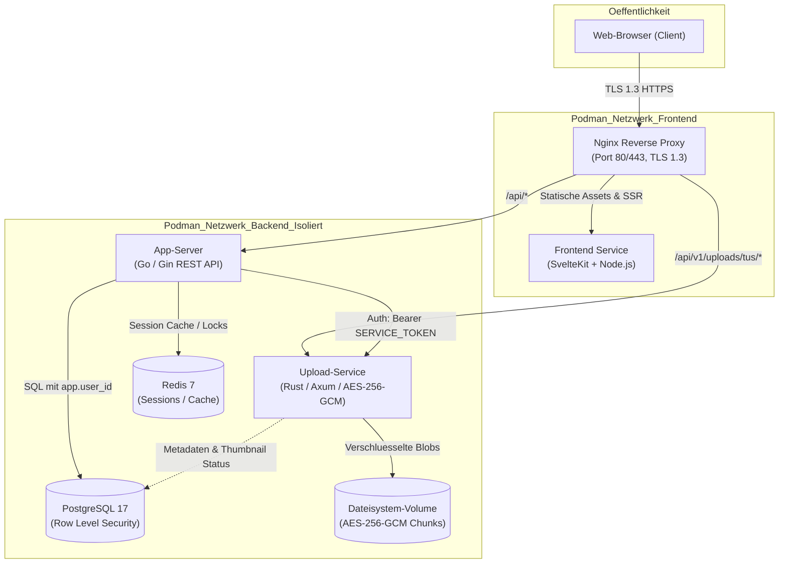
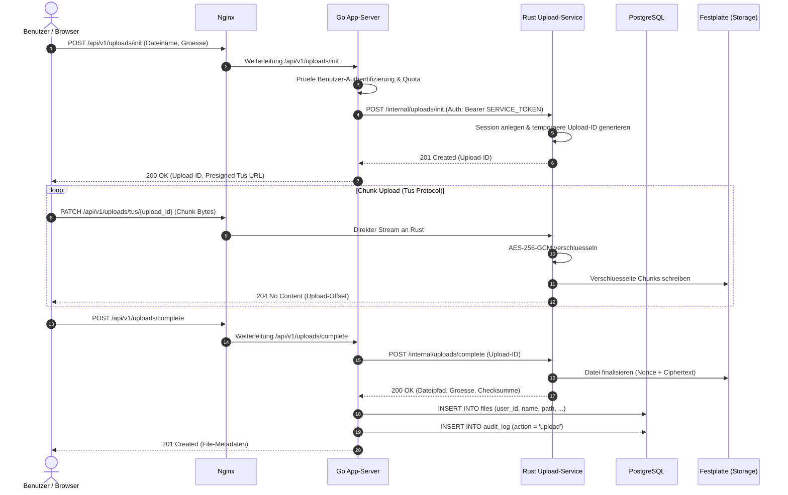
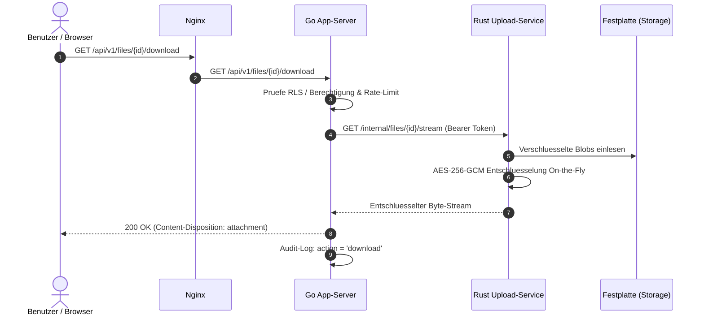
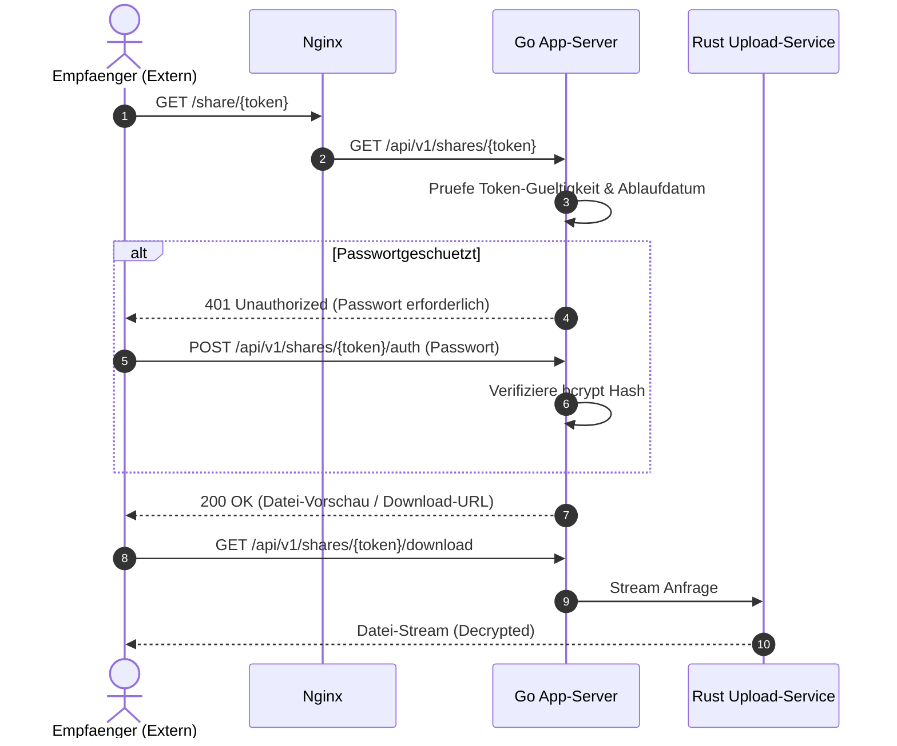

# Architektur-Dokumentation: 4LabCloud

4LabCloud ist als moderne, micro-service-orientierte On-Premises-Cloud-Plattform konzipiert. Ziel ist es, höchste Datensicherheit, vollständige Souveränität und maximale Upload-Geschwindigkeit zu vereinen.

---

## 1. Komponenten-Übersicht



### Die Rollen der Services:
1. **Nginx**: Einziger öffentlich exponierter Endpunkt. Erzwingt TLS 1.3 nach BSI TR-02102-2, Security-Header und striktes Rate-Limiting.
2. **Go (App-Server)**: Verwaltet Benutzer, Sessions, Authentifizierung (inkl. optionaler TOTP-MFA), Metadaten, Freigaben, Quotas und Audit-Logs.
3. **Rust (Upload-Service)**: Reiner High-Performance Storage- und Chunking-Dienst. Führt transparente AES-256-GCM Verschlüsselung durch. Liest niemals Datei-Inhalte aus.
4. **PostgreSQL 17**: Persistiert Benutzer- und Datei-Metadaten. Nutzt strikte Row Level Security (RLS) zur Isolation zwischen Mandanten.
5. **Redis 7**: Schneller Key-Value-Store für aktive Sitzungen, Rate-Limits und temporäre Upload-Token.
6. **SvelteKit (Frontend)**: Performantes, barrierefreies UI mit TailwindCSS und Uppy für robuste Chunk-Uploads.

---

## 2. Datenflüsse & Sequenzdiagramme

### A. Upload-Ablauf (Presigned Tus Chunking)
Der Upload läuft direkt vom Browser über Nginx an den Rust-Upload-Service, ohne den Go-App-Server mit Streaming-Daten zu belasten:



### B. Download-Ablauf


### C. Share-Ablauf (Öffentliche Freigaben)


---

## 3. Sicherheits- und Isolationskonzept

### Row Level Security (RLS) in PostgreSQL
Jede schreibende oder lesende Abfrage in der Datenbank erfolgt unter Mandantenisolierung.
```sql
ALTER TABLE files ENABLE ROW LEVEL SECURITY;

CREATE POLICY files_isolation_policy ON files
    FOR ALL
    TO cloud_app_role
    USING (user_id = NULLIF(current_setting('app.user_id', true), '')::uuid);
```
Der Go-App-Server setzt vor jeder Transaktion `SET LOCAL app.user_id = '...'`. Ein Zugriff über Benutzergrenzen hinweg ist auf Datenbankebene physikalisch unmöglich.

### Verschlüsselung (At Rest & In Transit)
- **In Transit**: Ausschließlich TLS 1.3 mit PFS (Forward Secrecy) an Nginx. Internes Docker/Podman-Backend-Netzwerk ist nicht nach außen geroutet.
- **At Rest**: AES-256-GCM. Jede Datei erhält eine zufällige 12-Byte-Nonce. Das Datei-Format auf der Festplatte folgt strikt dem Standard:
  `[12 Bytes Nonce][Verschluesselte Nutzdaten (Ciphertext)][16 Bytes GCM Auth-Tag]`.

### Service-to-Service Token
Der Rust-Upload-Service weist alle Anfragen ohne gültigen `Authorization: Bearer <SERVICE_TOKEN>` Header im isolierten Backend-Netzwerk mit `401 Unauthorized` ab.
