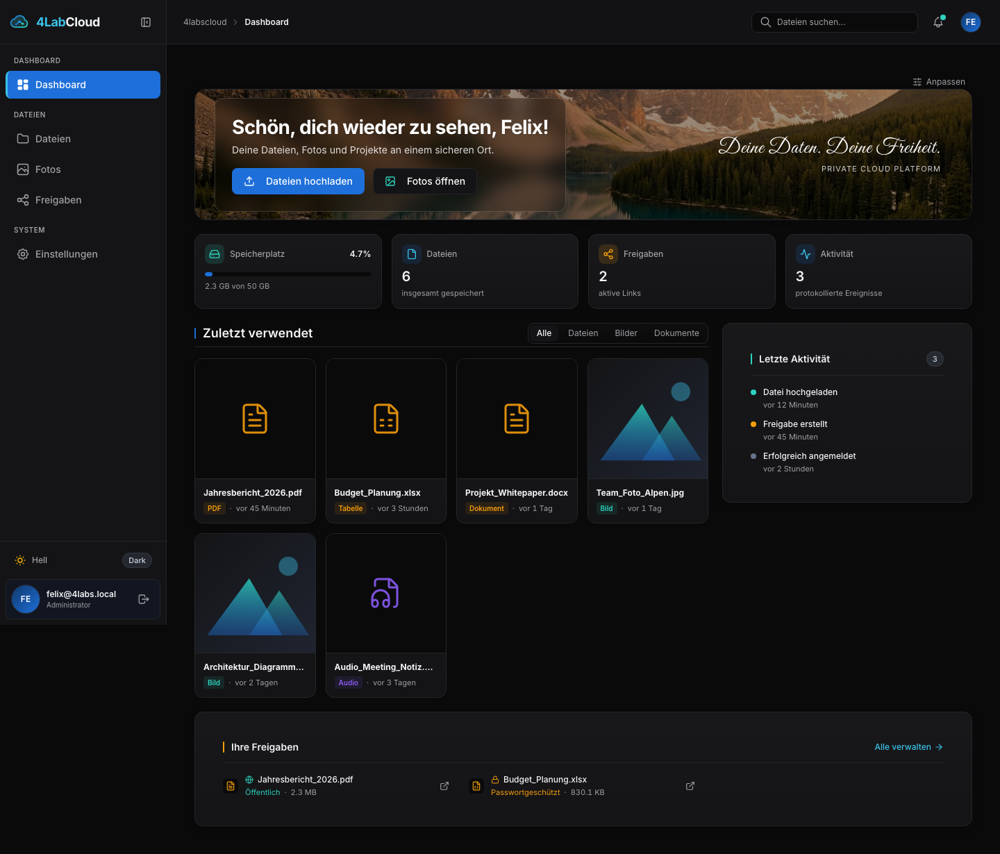
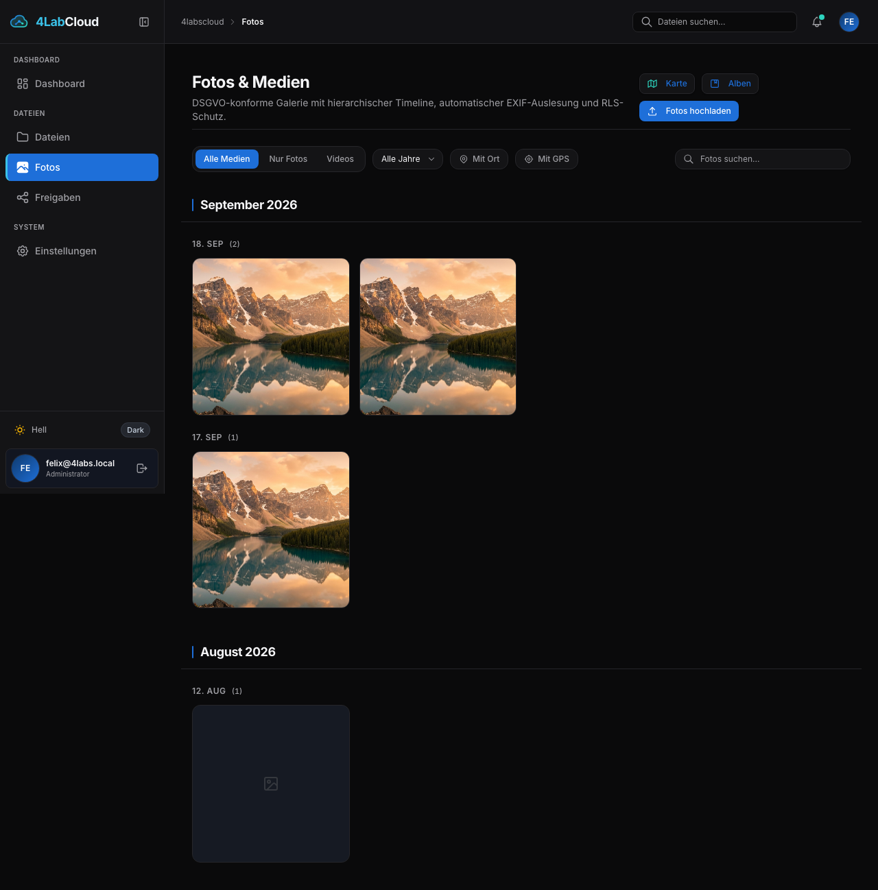
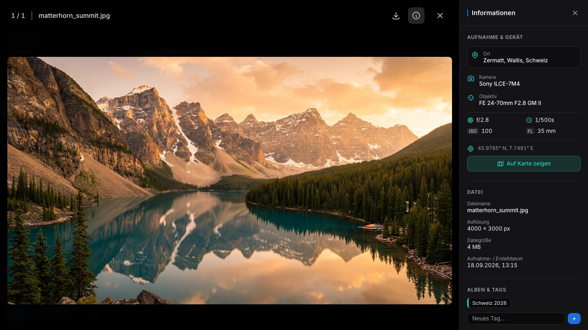
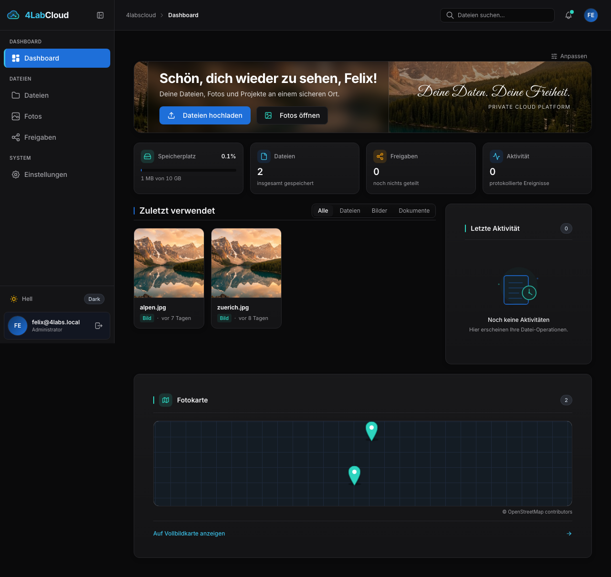
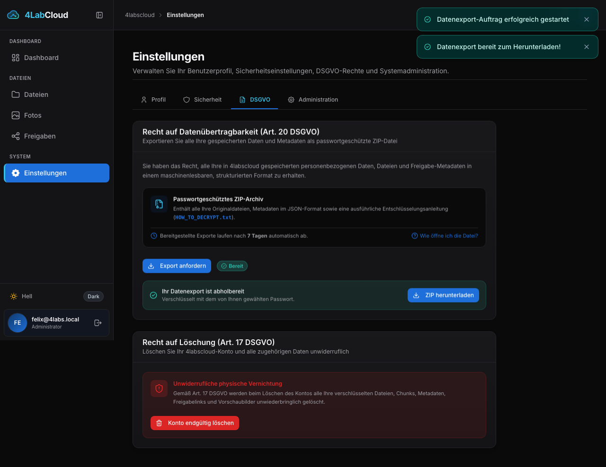
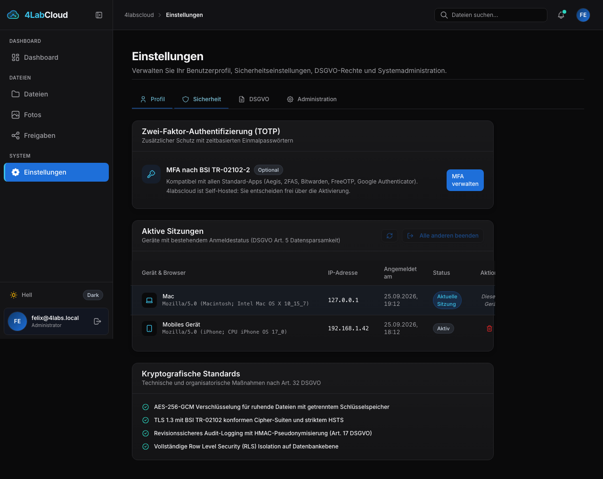

# 4LabCloud – Technische Dokumentation & Handbuch

Willkommen in der offiziellen Dokumentation von **4LabCloud**, einer souveränen Open-Source-Plattform für verschlüsselten Dateiupload, Medienverwaltung und sichere Freigaben nach europäischen Datenschutzstandards.

> Diese Dokumentation beschreibt **Version 0.2.4**. Der vollständige Änderungsverlauf steht im [Changelog](https://github.com/Der-Felix/4Lab_Cloud/blob/main/CHANGELOG.md).

---

## 📸 Screenshots & Benutzeroberfläche

### Modernes Dashboard & Navigation
4LabCloud bietet ein responsives Interface mit Dark-/Light-Mode, schneller Dateisuche, Speicherkontingent-Anzeige und Schnellzugriff auf aktuelle Aktivitäten.



---

### Fotoverwaltung, Timeline & EXIF-Inspektor
Fotos werden chronologisch nach Monaten und Tagen gruppiert. Zu jedem Foto stehen vollständige EXIF-Kameradaten (Kamera, Objektiv, Blende, Belichtungszeit, ISO, Brennweite) sowie der per Reverse-Geocoding ermittelte Aufnahmeort bereit.

| Chronologische Foto-Timeline | EXIF-Sidebar & Metadaten |
|---|---|
|  |  |

---

### Kartenintegration (OpenStreetMap & Leaflet)
Georeferenzierte Fotos werden auf interaktiven Karten im Dashboard und in einer dedizierten Vollbild-Kartenansicht visualisiert:



---

### Datenschutz, DSGVO & Administration
Vollständige Selbstverwaltung für Benutzer gemäß Art. 17 (Recht auf Vergessenwerden) und Art. 20 (Datenübertragbarkeit) sowie transparente Sitzungsübersicht und revisionssicheres Audit-Logging:

| DSGVO-Self-Service & Export | Aktive Sitzungen & Sicherheit |
|---|---|
|  |  |

---

## 📚 Dokumentations-Kapitel

Detaillierte Spezifikationen und Anleitungen für Entwickler und Administratoren:

- **[Architektur & Datenflüsse](ARCHITECTURE.html)**:
  - Microservice-Architektur (Nginx, Go-App-Server, Rust-Storage-Service, PostgreSQL 17, Redis 7)
  - Presigned Tus Chunk-Uploads direkt in den Rust-Service mit transparenter AES-256-GCM Verschlüsselung
  - Row Level Security (RLS) zur strikten Mandantentrennung auf Datenbankebene
  - Asynchrones Reverse-Geocoding mit self-hosted Nominatim und Caching
- **[Compliance & Sicherheit](COMPLIANCE.html)**:
  - DSGVO-Artikel-Mapping (Art. 5 Datenminimierung, Art. 17 Löschkonzept, Art. 20 Export, Art. 32 TOM)
  - BSI TR-02102-2 Konformität (ausschließliche Nutzung von TLS 1.3 mit PFS)
  - HMAC-SHA256 Pseudonymisierung in Audit-Logs und strikte Zero-SaaS-Richtlinie (keine externen CDNs/Fonts/Tracker)
- **[Installationsanleitung](INSTALL.html)**:
  - Schritt-für-Schritt-Einrichtung einer eigenen Instanz inkl. TLS, Geheimnissen und erstem Administrator
  - Aktualisieren, Migrationen einspielen, Deinstallation
- **[Design-System & UI-Regeln](DESIGN.html)**:
  - Farbtoken mit Kontrastnachweis für Hell- und Dunkelmodus, Typo-Skala, Dichtevorgaben
- **[Entwicklungshandbuch](DEVELOPMENT.html)**:
  - Repository-Aufbau, Toolchain, Tests für Frontend, Go und Rust
  - Container nach Codeänderungen korrekt neu bauen, Migrationen, Konventionen
- **[Backup- & Wiederherstellungsstrategie](BACKUP.html)**:
  - 3-2-1 Backup-Konzept für Datenbank- und Storage-Volumes
  - Automatisiertes Backup-Skript (`scripts/backup.sh`) mit Grandfather-Father-Son (GFS) Rotation
  - Disaster Recovery (`scripts/restore.sh`) mit automatischer Datenverifikation

---

## 🚀 Schnelleinstieg

```bash
git clone https://github.com/Der-Felix/4Lab_Cloud.git
cd 4Lab_Cloud
cp .env.example .env
cd deploy/podman && podman-compose --env-file ../../.env up -d
```

Anschließend erreichbar unter `https://localhost:8443` (im Entwicklungsmodus mit selbstsigniertem Zertifikat). Der erste registrierte Benutzer wird automatisch Administrator.

Produktionsaufbau, Umgebungsvariablen und Fehlerbehebung stehen in der [README](https://github.com/Der-Felix/4Lab_Cloud/blob/main/README.md).

---

## 🛠 Tech-Stack im Überblick

- **Frontend**: SvelteKit (Svelte 5), TypeScript, TailwindCSS v4, Leaflet; Icons aus `@lucide/svelte` und `@tabler/icons-svelte`
- **App-Server**: Go 1.24, Gin Framework, `pgx/v5` (kein ORM), Redis Client
- **Upload- & Storage-Service**: Rust (Edition 2021), Axum, Tokio, AES-256-GCM (`aes-gcm`), `kamadak-exif`
- **Datenbank & Cache**: PostgreSQL 17 (mit RLS), Redis 7
- **Infrastruktur**: Nginx (TLS 1.3 Only Gateway), Podman & Podman Compose

Zurück zum [GitHub Repository](https://github.com/Der-Felix/4Lab_Cloud).
